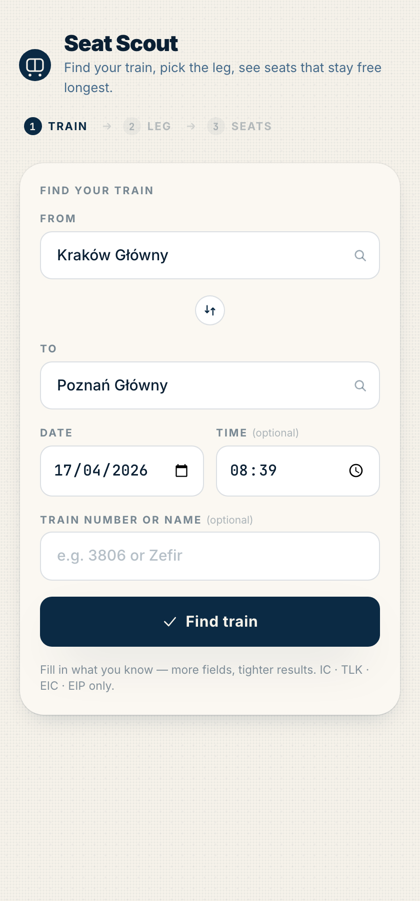
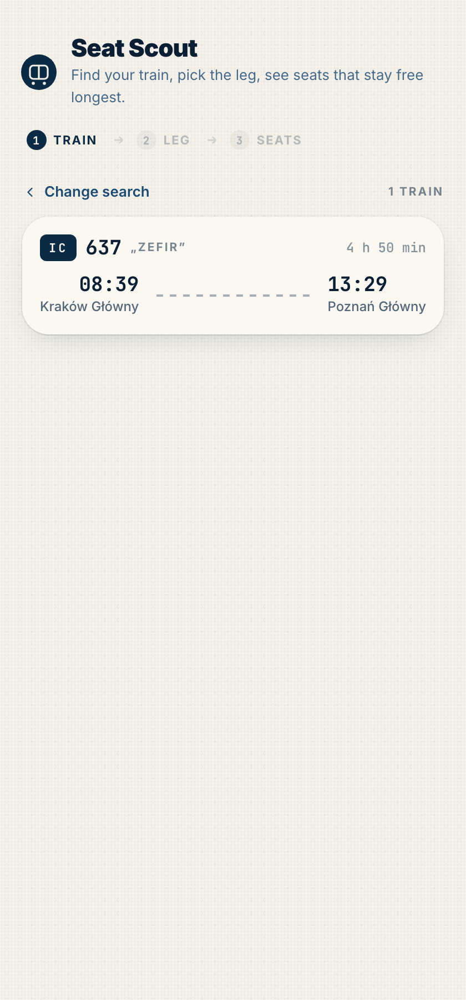
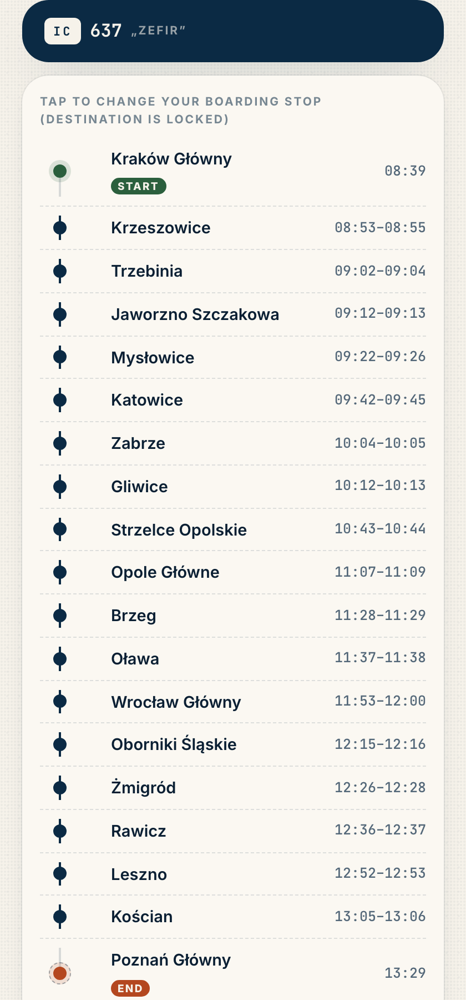
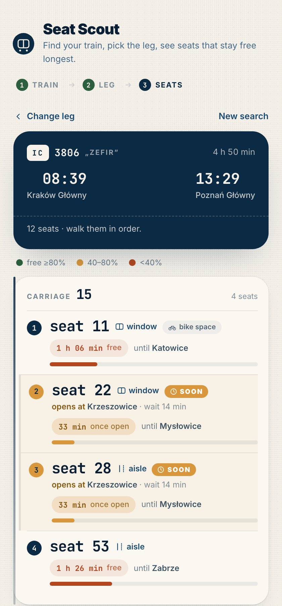

# Seat Scout 🚆

You bought a PKP Intercity ticket with no seat reservation. The train is packed.
You walk down the corridor, reading seat numbers, hoping nobody with a real
reservation is about to kick you out.

This helps.

Give it the day, a station or two, maybe a train number or name. It finds your
train, shows you the stops on your leg, and hands you a little walking plan:
the 5–10 seats most likely to stay yours the longest — plus a couple that
open up after 1–2 stops (for when you're feeling patient).

## The tour 👀

<table>
  <tr>
    <td align="center" width="50%">
      <b>1 · Find your train</b><br/>
      <sub>Any combo of from / to / date / time / number works.</sub><br/>
      
    </td>
    <td align="center" width="50%">
      <b>2 · Pick the right one</b><br/>
      <sub>Matching IC / TLK / EIC / EIP trains, as ticket-stubs.</sub><br/>
      
    </td>
  </tr>
  <tr>
    <td align="center" width="50%">
      <b>3 · Pick your leg</b><br/>
      <sub>Tap any stop to move your boarding point. Destination stays locked.</sub><br/>
      
    </td>
    <td align="center" width="50%">
      <b>4 · Walk the plan</b><br/>
      <sub>Free-now seats plus amber "soon" ones that open in 1–2 stops.</sub><br/>
      
    </td>
  </tr>
</table>

## Run it

```bash
python3 -m venv .venv
.venv/bin/pip install -r requirements.txt
.venv/bin/uvicorn main:app --reload
```

Open <http://localhost:8000>. That's it.

> **macOS python.org users:** if you get `CERTIFICATE_VERIFY_FAILED`, run
> `bash "/Applications/Python 3.13/Install Certificates.command"` once.

## Put it on the internet

There's a `Dockerfile`. Drop the repo into Railway / Render / Fly.io and they'll
build and run it. No env vars. No database. No drama.

```bash
# or just run it with docker locally
docker build -t seat-scout . && docker run --rm -p 8000:8000 seat-scout
```

## What "free" actually means

**Free = no reservation on file.** It does **not** mean "physically empty".
Another unreserved-ticket passenger may already be warming that seat. That's
why the app hands you a *list* — walk past them in order, grab the first one
that's actually vacant.

If a seat is flagged as **wheelchair / bike / quiet zone / family compartment**,
that's shown too — those usually stay unclaimed, so they're actually some of
the best bets on a packed train. Just be ready to move if someone who actually
needs it shows up.

## The small print nobody reads

- Uses the unofficial Koleo API. Be nice to it.
- IC / TLK / EIC / EIP only. Regional trains don't have reservations — just get
  on and sit.
- The `koleo-cli` library points `find_station()` at a URL that 404s; the app
  routes around it. If you rebuild the app and it mysteriously can't find
  stations, that's probably the issue.
- Koleo's "train number" for a leg is sometimes different from what's printed
  on your ticket (leg 637 vs printed 3806 is the same physical train, the
  Zefir). The display uses the public number your ticket shows.

## Not planned

No login, no saved searches, no multi-train journeys, no fancy cache, no
ads, no tracking. If it breaks, refresh.

Godspeed, fare dodger of the soft kind. May your seat stay yours all the way
to Poznań or somewhere.
